# JARVIS Memory Pipeline - Visual Flow

This document provides visual representations of the JARVIS memory architecture pipeline flows.

---

## 1. Complete Knowledge Flow (End-to-End)

```mermaid
graph TB
    subgraph "Stage 1: INGESTION"
        A[Raw Documents] -->|Parse| B{Document Type?}
        B -->|PDF| C[pdfplumber]
        B -->|Markdown| D[AST Parser]
        B -->|Text| E[Line Chunker]
        B -->|JSON| F[GPT Export Parser]
        B -->|Jupyter| G[Cell Parser]

        C --> H[Semantic Chunker]
        D --> H
        E --> H
        F --> H
        G --> H

        H -->|1200-1500 chars| I[Embedding Generator]
        I -->|all-mpnet-base-v2| J[768-dim Vectors]

        J --> K{Duplicate?}
        K -->|Hash exists| L[Skip]
        K -->|New hash| M[Qdrant Upsert]

        M --> N[(Qdrant Collections)]
    end

    subgraph "Stage 2: CATALOG"
        N --> O[Domain Classifier]
        O --> P{Heuristics Match?}
        P -->|Yes ~70%| Q[Keyword Map]
        P -->|No ~30%| R[LLM Classifier]

        Q --> S[Domain Assigned]
        R -->|Gemini 2.0 Flash| S

        S --> T[Update Qdrant Payload]
        T --> U[domain field set]
    end

    subgraph "Stage 3: PROFILE"
        U --> V[Group by source_file]
        V --> W[Count domain frequencies]
        W --> X{Majority Vote}
        X -->|>50% confidence| Y[Primary Domain]
        X -->|<50% confidence| Z[Flag for Review]

        Y --> AA[Update doc_primary_domain]
        Z --> AA
        AA --> AB[Document Profile Complete]
    end

    subgraph "Stage 4: ENRICHMENT"
        AB --> AC{High-value doc?}
        AC -->|Yes| AD[Sample Windows]
        AC -->|No| AE[Skip Enrichment]

        AD -->|Beginning, Middle, End| AF[LLM Enrichment]
        AF -->|Gemini 2.0 Flash| AG{Generate}

        AG --> AH[Summary]
        AG --> AI[Facts]
        AG --> AJ[Tags]
        AG --> AK[doc_type]

        AH --> AL[Update Qdrant Payload]
        AI --> AL
        AJ --> AL
        AK --> AL

        AL --> AM[Enriched Memory]
        AE --> AM
    end

    subgraph "RETRIEVAL LAYER"
        AM --> AN{Query Mode?}

        AN -->|Semantic| AO[Embed Query]
        AN -->|Keyword| AP[BM25 Search]
        AN -->|Hybrid| AQ[Both + Fusion]
        AN -->|Expanded| AR[Multi-Query + RRF]

        AO --> AS[Qdrant Search]
        AP --> AS
        AQ --> AT[Weighted Combine]
        AR --> AU[Generate Variations]

        AT --> AS
        AU --> AV[Retrieve All Queries]
        AV --> AW[RRF Fusion]
        AW --> AS

        AS --> AX[Top-K Results]
    end

    subgraph "LLM CONTEXT"
        AX --> AY[Build Context Window]
        AY --> AZ[System Prompt + Sources]
        AZ --> BA{LLM Provider?}

        BA -->|auto| BB[Cost-First Router]
        BA -->|specific| BC[Direct Provider]

        BB --> BD[OpenRouter]
        BB --> BE[Perplexity]
        BB --> BF[Local Ollama]
        BB --> BG[Direct API]

        BD --> BH[Generate Answer]
        BE --> BH
        BF --> BH
        BG --> BH
        BC --> BH

        BH --> BI[Response + Citations]
    end

    subgraph "PERSISTENCE"
        BI --> BJ[(PostgreSQL)]
        BJ --> BK[Conversations Table]
        BJ --> BL[Messages Table]

        BL --> BM[citation_provenance JSON]
        BM --> BN[Analytics Ready]
    end

    style A fill:#e1f5ff
    style N fill:#fff4e1
    style AM fill:#e8f5e9
    style BI fill:#f3e5f5
    style BN fill:#fce4ec
```

---

## 2. Domain Classification Decision Tree

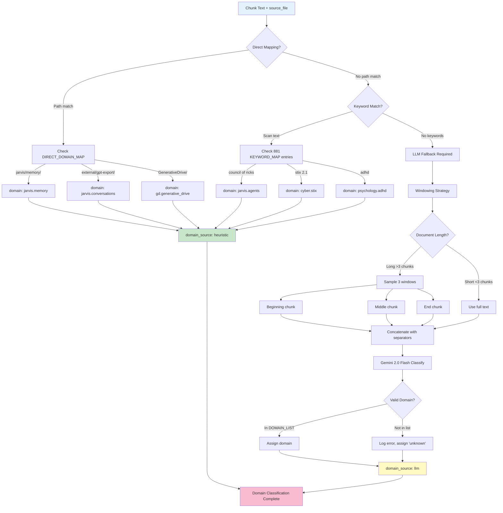

---

## 3. Document Profiling (Majority Vote)

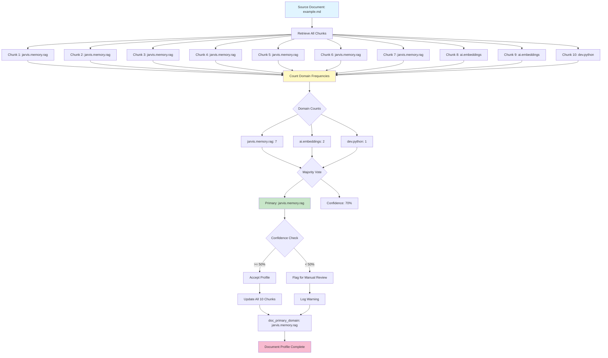

---

## 4. Retrieval Strategy Comparison

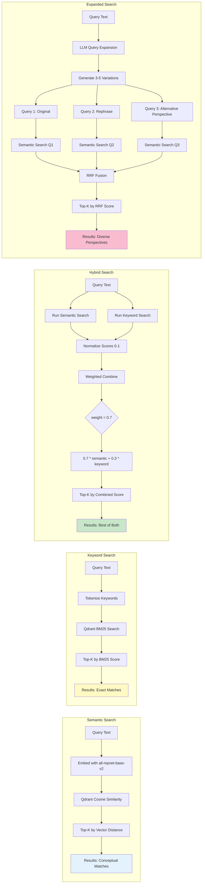

---

## 5. Cognitive Patterns (Decision Flows)

### Pattern 1: Heuristic → LLM Fallback

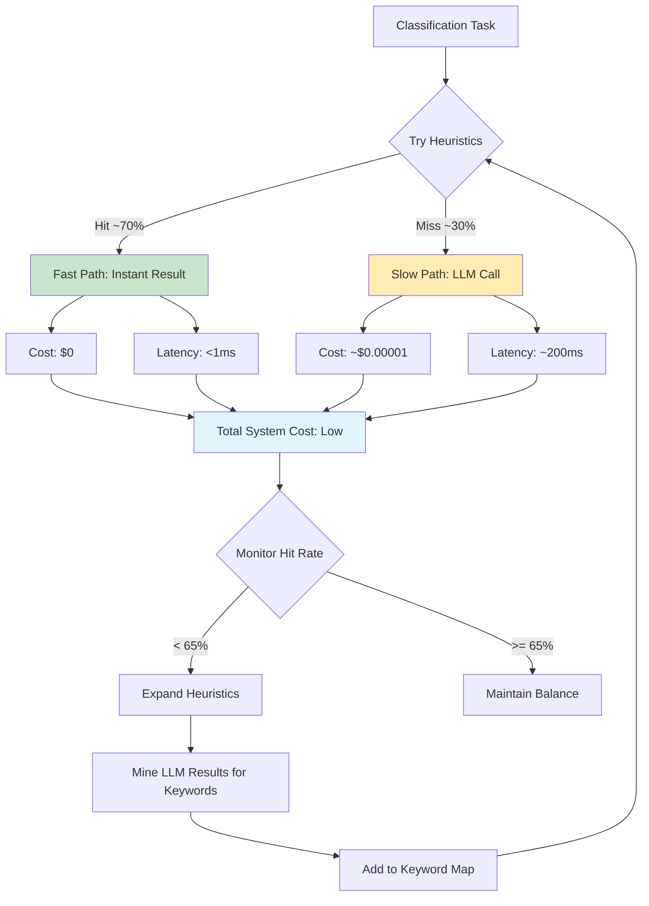

### Pattern 2: Windowing Strategy

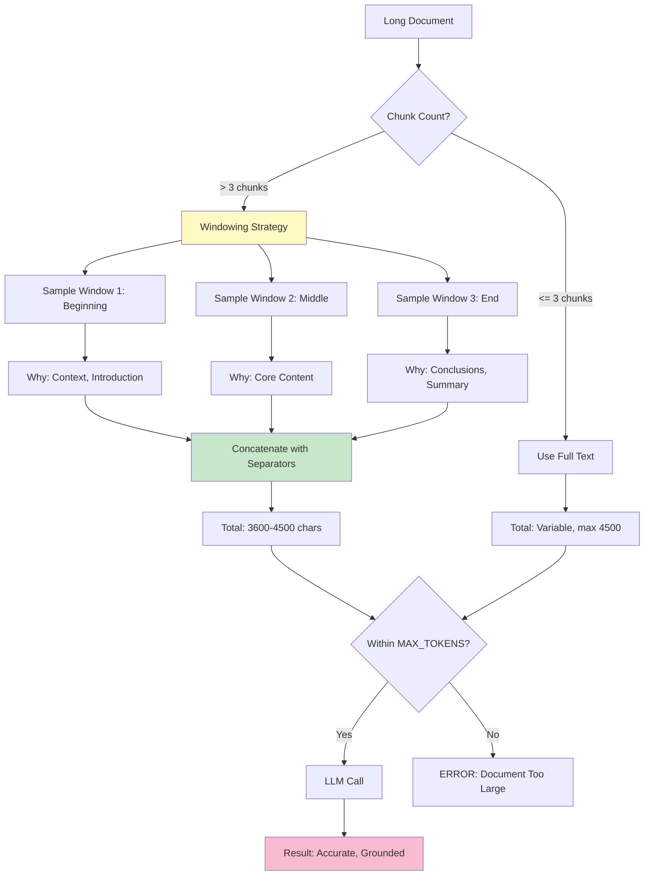

### Pattern 3: Dual-Level Classification

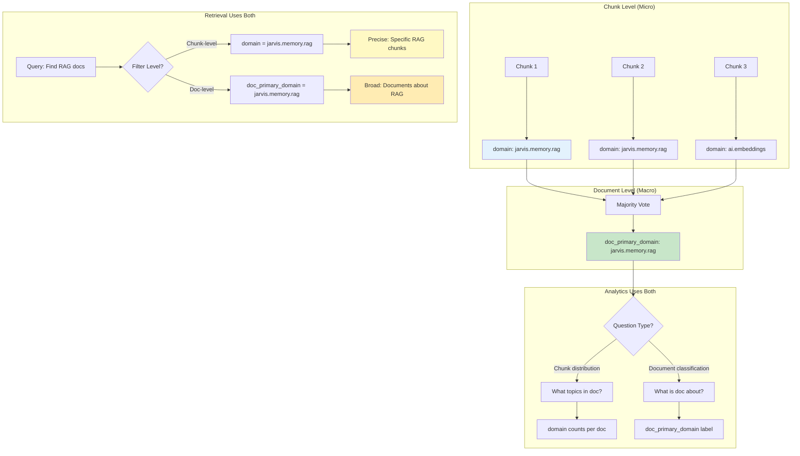

---

## 6. Memory Architecture Layers

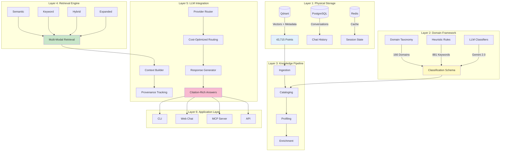

---

## 7. Iteration Evolution Timeline

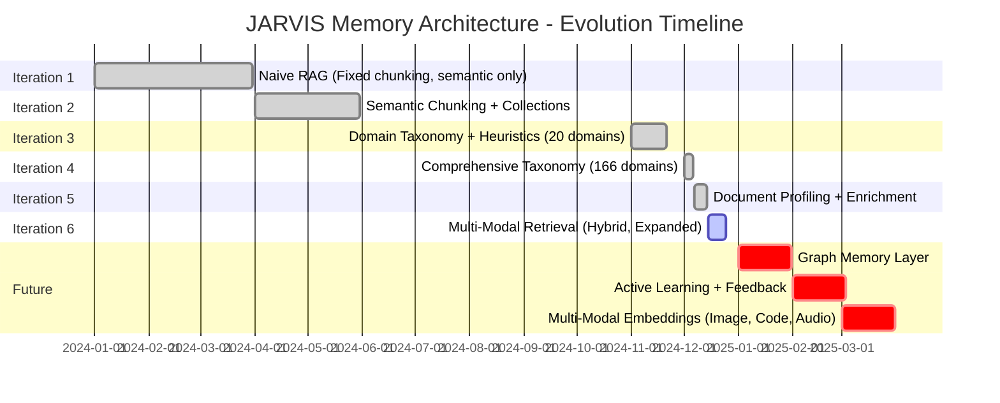

---

## 8. Cost vs. Quality Trade-offs

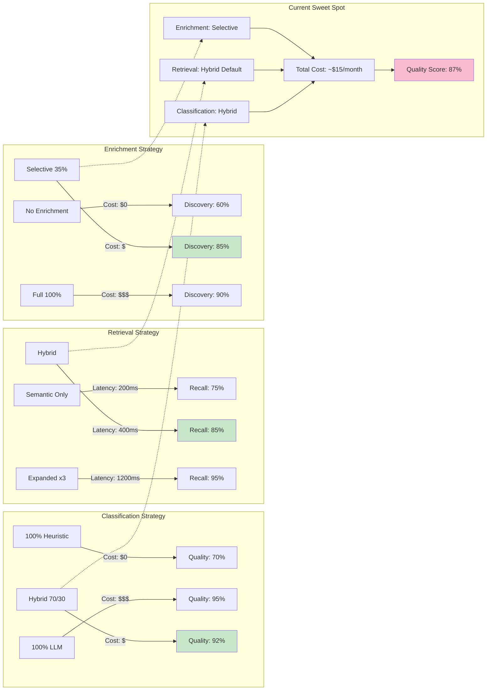

---

## 9. Data Flow: Query to Answer

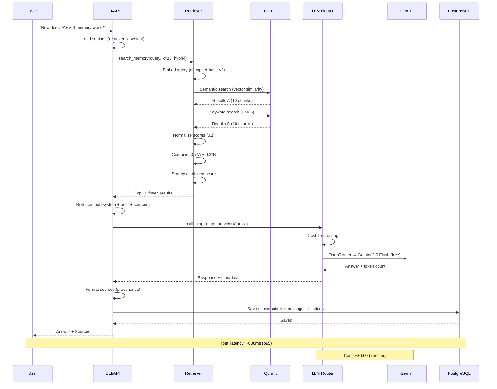

---

## 10. Health Check Flow

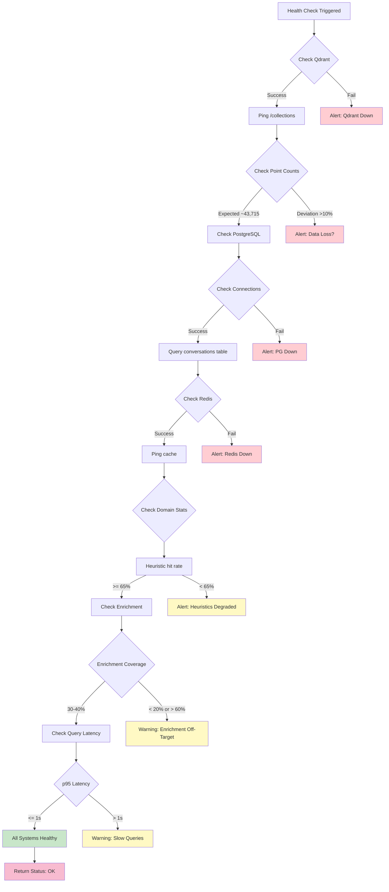

---

## Summary

These visual flows complement the [jarvis-memory-architecture.md](jarvis-memory-architecture.md) document by showing:

1. **Complete Knowledge Flow** - How data moves from raw docs to answers
2. **Domain Classification** - Decision tree for heuristic vs LLM
3. **Document Profiling** - Majority vote visualization
4. **Retrieval Strategies** - Four modes compared
5. **Cognitive Patterns** - How JARVIS thinks (heuristics, windowing, dual-level)
6. **Architecture Layers** - 6-layer stack
7. **Evolution Timeline** - 6 iterations over 12 months
8. **Cost vs Quality** - Trade-off analysis
9. **Query to Answer** - Sequence diagram
10. **Health Checks** - Monitoring flow

Together, these visualizations make the "building blocks pointing to something" concept tangible - showing how 43,715 knowledge atoms flow through cognitive patterns to produce intelligent, citation-backed answers. ✨

---

**Document Version**: 1.0
**Last Updated**: 2025-12-02
**Related Docs**:
- [jarvis-memory-architecture.md](jarvis-memory-architecture.md) - Complete architecture reference
- [domain-taxonomy.md](domain-taxonomy.md) - Domain classification framework
